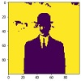
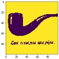
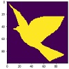
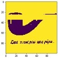
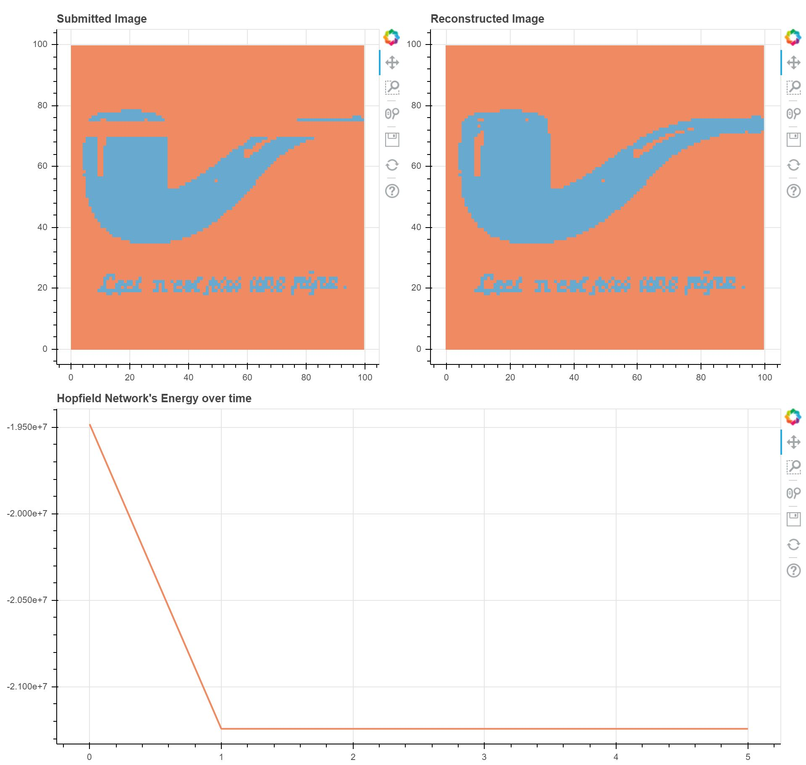

# ANN---Hopfield-Network
Implementation of a Hopfield network in Python. A good summary of these networks' properties can be found in the paper from Sebastian Seung from MIT Department of Brain and Cognitive Sciences. _(A pdf of this paper is linked below and available in the repo.)_

## Usage
Use the class `HopfieldNet` to instantiate a new Hopfield network. 
```python
>>>hopnet = HopfieldNet()
```

To store some patterns in our new Hopfield network, you need to use the `store` method. By passing a list of vectors (1D or 2D) as argument, the network will automatically create the required neurons and adjust the weights such as to memorize those vectors as individual patterns. A second argument can be passed if one wants to use the _Storkey_ learning rule rather than the _Hebbian_ learning rule (which is set by default).
```python
>>>hopnet.store(data=x, learning_rule='Storkey')
```
Note that depending on the number of neurons (i.e. the number of pixels in our image, if you stored images as patterns), the Hopfield network will be able to store effectively more or less patterns. The higher the number of neurons, the more patterns it will be able to memorize. However, due to memory constraints, patterns requiring more than 22500 neurons are not advised. Furthermore, the patterns must be relatively different to one another in order to avoid overlapping bassins of attractors.

Once your Hopfield network has stored your patterns, you can start submitting corrupted patterns or similar patterns to recall the stored pattern which is the most similar. This achieved with the `predict` method:
```python
>>>y_pred, energy = hopnet.predict(data=y)
```
This method returns two elements. _y_pred_ contains a list of recalled patterns corresponding to the elements in the list _y_. _energy_ is a list of the Hopfield network's energy at each timestep.

Multiple parameters can be passed to this `predict` method
- _nbr_iterations_: number of iterations during with the neurons' state will be updated
- _sync_update_: if True then all neurons are updated at each iteration. If False, a random neuron is considered for update at each timestep
- _activation_fcn_: function used for the update of the neurons' state, currently only support 'sign'
- _threshold_: threshold used for the activation function
- _show_: if True then bokeh will be used to show the recovered pattern as well as the energy of the network. Only works when one corrupted pattern is submitted

Example:
```python
>>>y_pred, energy = hopnet.predict(data=y, nbr_iterations=300, sync_update=False, show=True)
```
## Example
Let's assume that we want our Hopfield network to recognise corrputed paintings of Magritte. For this we will select three of his paintings and convert them to binary paintaings of smaller size:

Original --> Converted

 --> 

 --> 

 --> 

Those binary paintings will make our data set _x_. We can now create a Hopfield network to store those patterns in memory. This is done with the following line of code:
```python
>>>magritte__discriminator = hopnet.store(data=x)
```
We can then corrupt when of the painting and see if our network will still be able to recognize it. Here is the corrupted painting that we will submit as _y_:



```python
>>>y_pred, energy = magritte__discriminator.predict(data=y, nbr_iterations=5, sync_update=True, show=True)
```
This command will open a new window in the browser where the reconstructed paintaing can be seen as well as the energy of the network at each time step:



## Requirements
- Python 3.x
- numpy
- math
- bokeh (optional)

## Source
__[Seung - The Hopfield model](https://ocw.mit.edu/courses/brain-and-cognitive-sciences/9-29j-introduction-to-computational-neuroscience-spring-2004/readings/hss_assocmem1.pdf)__
